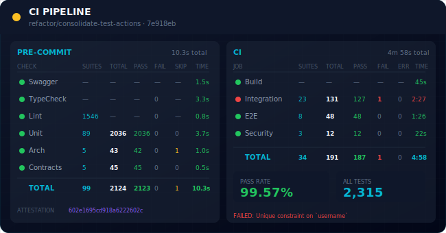
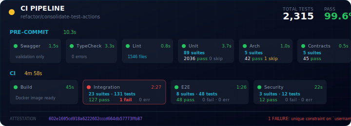
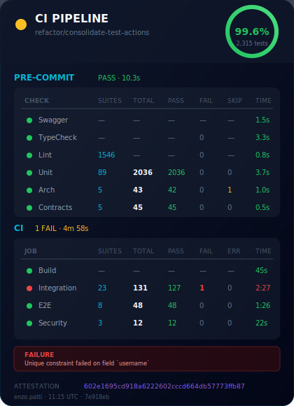
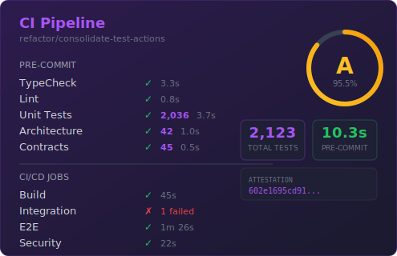
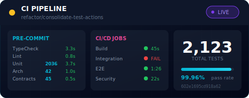
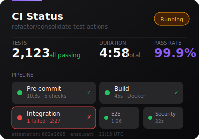

# CI Card Previews

## Neon Cyber Variations (Full Metrics)

### V1: Expanded Table Layout (650x340)
Two-column table layout with complete metrics per check.

---

### V2: Compact Horizontal (720x260)
Horizontal card-based layout, wider but shorter.

---

### V3: Vertical Dashboard (420x580)
Mobile-friendly vertical layout with pass rate ring.

---

## Comparison

| Variation | Dimensions | Layout | Best For |
|:----------|:-----------|:-------|:---------|
| **V1 Expanded** | 650x340 | Two-column tables | Full metrics dashboard |
| **V2 Compact** | 720x260 | Horizontal cards | Wide PRs, quick scan |
| **V3 Vertical** | 420x580 | Vertical stacked | Mobile, narrow views |

## Metrics Shown

All variations include:
- **PRE-COMMIT**: Swagger, TypeCheck, Lint, Unit, Arch, Contracts
- **CI**: Build, Integration, E2E, Security
- Per check: Suites, Total tests, Passed, Failed, Skipped/Errors, Time
- Total pass rate
- Attestation hash
- Error details when failures occur

---

## Legacy Styles

### Purple Haze
Dark purple gradient with golden grade ring.

---

### Neon Cyber (Original)
Cyberpunk aesthetic, compact.

---

### Minimal Dark
Clean, modern, minimal.

